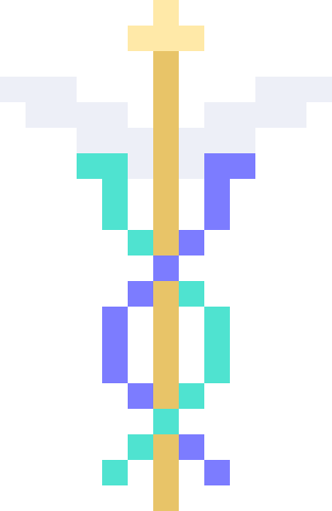

<div align="center">
  
  <h1>Caduceus</h1>
  <p><strong>A fast, local-first command centre for your Mac.</strong></p>
  <p>
    A floating staff that stays out of your way, a command palette that launches
    apps and does maths, a clipboard that remembers, and an AI agent that can
    drive your machine when you ask it to.
  </p>
  <p>
    <a href="#install">Install</a> ·
    <a href="#what-it-does">What it does</a> ·
    <a href="#the-ai-part">The AI part</a> ·
    <a href="#building-from-source">Build from source</a>
  </p>
</div>

---

## Install

**macOS 11+, Apple Silicon or Intel.** One line:

```bash
curl -fsSL https://vivaanshahani.com/caduceus/install.sh | bash
```

That downloads the universal `.dmg` from the latest release, mounts it, copies
the app to `/Applications`, removes the quarantine flag, and launches it. About
10 MB and ten seconds, with no toolchain and nothing to configure.

Prefer to do it yourself? Download the `.dmg` from
[Releases](https://github.com/GeoWizard4645/caduceus/releases), drag Caduceus to
Applications, then run this once:

```bash
xattr -dr com.apple.quarantine /Applications/Caduceus.app
```

<details>
<summary><strong>Why that last command is needed</strong></summary>

Caduceus is not signed with an Apple Developer certificate yet, so macOS marks
it as quarantined and refuses to open it. `xattr -dr com.apple.quarantine`
clears that flag — it is the same thing the right-click → Open dance does, more
directly. You are telling macOS you trust this specific app, which you should
only do because you can read the source in this repo and build it yourself.

The installer runs that command for you, so the one-liner above needs no
follow-up.

</details>

Would rather run only code you compiled? The installer will do that too, at the
cost of a Rust and Node toolchain and a few minutes:

```bash
curl -fsSL https://vivaanshahani.com/caduceus/install.sh | bash -s -- --from-source
```

Caduceus lives in your menu bar. There is no Dock icon.

---

## What it does

### The floating staff

A pixel Caduceus staff that sits on top of everything, on the right edge by default.

- **Hover it** — six shortcut icons fan out around it
- **Click it** — opens the Command Center
- **Right-click it** — opens Settings
- **Drag it** — anywhere you like; it remembers
- **`F12`** — hide or show it

It goes back to being click-through the moment your pointer leaves, so it never
eats a click meant for something behind it.

### The Command Center

`Alt+Space`, or click the staff.

| You type | What happens |
|---|---|
| `figma` | launches Figma — every app on your Mac is searchable |
| `1920/16*9` | shows `1,080`, Enter copies it |
| `18% of 240` | shows `43.2` |
| `flights to lisbon` | searches the web |
| `/ explain OAuth` | asks Hermes |
| `/c open my email and find the invoice` | Hermes drives your Mac |
| `/v invoice` | searches clipboard history |

Arrow keys to move, Enter to run, Esc to close. Prefixes are configurable — add
your own in Settings, or delete the ones you don't use.

### Clipboard history

Everything you copy — text, images, file paths — searchable, pinnable, and
prunable. Password managers that mark their copies as concealed are skipped
automatically, and there is an app exclusion list on top of that.

Optional **encryption at rest** with ChaCha20-Poly1305, keyed from your macOS
keychain. This protects your history from anything that can read the database
file. It does *not* protect against software running as you while Caduceus is
unlocked — that could ask the keychain for the key exactly as Caduceus does.
Lose the keychain entry and the old history is gone for good; that is the point.

### Voice

Hold `⌘⇧Space`, talk, let go. Transcription runs **on-device** through Apple's
Speech framework — audio never leaves your Mac.

What you said is then routed by keyword:

- "**search** cheap flights" → web search
- "**computer** close all my tabs" → Hermes drives the Mac
- anything else → asked as a question

All the keywords and their destinations are editable.

**There is no wake word, deliberately.** Always-on listening would mean a
process with permanent microphone access that also has screen control. The
microphone opens when you hold the key and closes when you let go.

---

## The AI part

Caduceus does not ship its own model, its own agent loop, or its own screen
control. It drives [**Hermes Agent**](https://github.com/NousResearch/hermes-agent)
— the open-source agent from Nous Research — which already does all three, far
better than a side project would.

Caduceus is the *surface*: a hotkey, a palette, a place for the answer to land.
Hermes is the engine.

**Setup is two commands.** Settings → AI will run them for you, or:

```bash
curl -fsSL https://hermes-agent.nousresearch.com/install.sh | bash
hermes setup --portal
```

Hermes works with whatever model you want — Nous Portal, OpenRouter, OpenAI,
Ollama running locally, your own endpoint. Caduceus follows whatever
`hermes model` is set to and has no opinion about it.

**Everything else works without any of this.** Shortcuts, the app launcher, the
calculator, clipboard history, voice transcription and web search all run with
Hermes uninstalled and zero API keys. The `/` and `/c` prefixes are the only
things that need it.

### Screen control

`/c` hands the task to Hermes' `computer_use` toolset. Caduceus asks you first,
every session, and shows a Stop button for as long as it runs. Turning the
confirmation off is possible and is a bad idea.

Because Hermes owns the screen control, *Caduceus itself* never asks for
Accessibility or Screen Recording permission. Hermes does, when you first use
it.

---

## Building from source

You need [Rust](https://rustup.rs), [Node](https://nodejs.org) 20+, and Xcode
Command Line Tools (`xcode-select --install`).

```bash
git clone https://github.com/GeoWizard4645/caduceus.git
cd caduceus
npm install
npm start                             # run in development
npm run tauri -- build --bundles app  # Caduceus.app into src-tauri/target/release/bundle/macos
npm run bundle                        # the same, plus a .dmg
```

Then drag it across:

```bash
cp -R src-tauri/target/release/bundle/macos/Caduceus.app /Applications/
```

Releases ship a single universal `.dmg` covering Apple Silicon and Intel, which
needs the Intel target installed once (`rustup target add x86_64-apple-darwin`):

```bash
npm run tauri -- build --target universal-apple-darwin --bundles dmg
```

Tests:

```bash
npm run test:rust  # 125 unit tests
npm run typecheck
```

### Layout

```
src/                     React — three webviews
  staff/                 the floating staff + radial pop-out
  command-center/        the palette, agent panel, clipboard view
  settings/              seven settings tabs
  shared/                IPC bindings, result providers, design system
src-tauri/src/           Rust
  agent/                 AgentBackend trait; Hermes + OpenAI-compatible impls
  apps.rs                installed-application index (the launcher)
  calc.rs                the calculator's expression parser
  clipboard/             watcher, SQLite store, encryption
  shortcuts/             the Shortcut primitive and how each kind executes
  voice/                 push-to-talk capture, speech-to-text, keyword routing
  palette.rs             prefix parsing and dispatch
  window/                staff placement, cursor tracking, window management
scripts/make-icons.py    generates every icon from one pixel grid
```

Two design rules worth knowing before you change things:

1. **The webview can only call named commands.** The `shell`, `fs` and `http`
   Tauri plugins are deliberately not enabled. Shortcuts run *by id* against
   saved settings — the frontend never hands Rust a command string to execute.
2. **Secrets only ever go in the keychain.** There is no command that reads an
   API key back out, so a compromised webview cannot exfiltrate one.

### Adding a result source

The palette is a list of providers. Add one object, append it to
`defaultProviders` in `src/shared/providers.ts`, done:

```ts
export const emojiProvider: ResultProvider = {
  id: "emoji",
  title: "Emoji",
  search({ query }) {
    if (!query) return [];
    return findEmoji(query).map((e) => ({
      id: `emoji:${e.name}`,
      title: e.char,
      subtitle: e.name,
      icon: e.char,
      group: "Emoji",
      score: 400,
      run: () => navigator.clipboard.writeText(e.char),
    }));
  },
};
```

### Adding an AI backend

Implement `AgentBackend` in `src-tauri/src/agent/`, add a `BackendKind` variant,
and add one arm to `backend_for()` in `agent/mod.rs`. The trait is small — look
at `hermes.rs`, which is a complete implementation in about 200 lines of real
logic.

### Redesigning the mark

Every icon — the app icon, the menu-bar template, and the staff you see on
screen — is generated from one pixel grid in `scripts/make-icons.py`. Edit the
grid, run `python3 scripts/make-icons.py`, and all of them update together. The
script prints an ASCII preview so you can check the shape without opening a PNG.

---

## Platform support

macOS only for now. The Rust source keeps its per-platform `cfg` blocks and
`Cargo.toml` keeps its target-specific dependency sections, so Windows and Linux
are a build-target change rather than a rewrite — but they are not built,
tested, or supported today. The pieces that would need real work are the
application index (`apps.rs`), frontmost-app detection for clipboard exclusions,
and the on-device speech helper.

---

## Licence

MIT. See [LICENSE](LICENSE).

Hermes Agent is a separate project by [Nous Research](https://nousresearch.com),
under its own licence.
